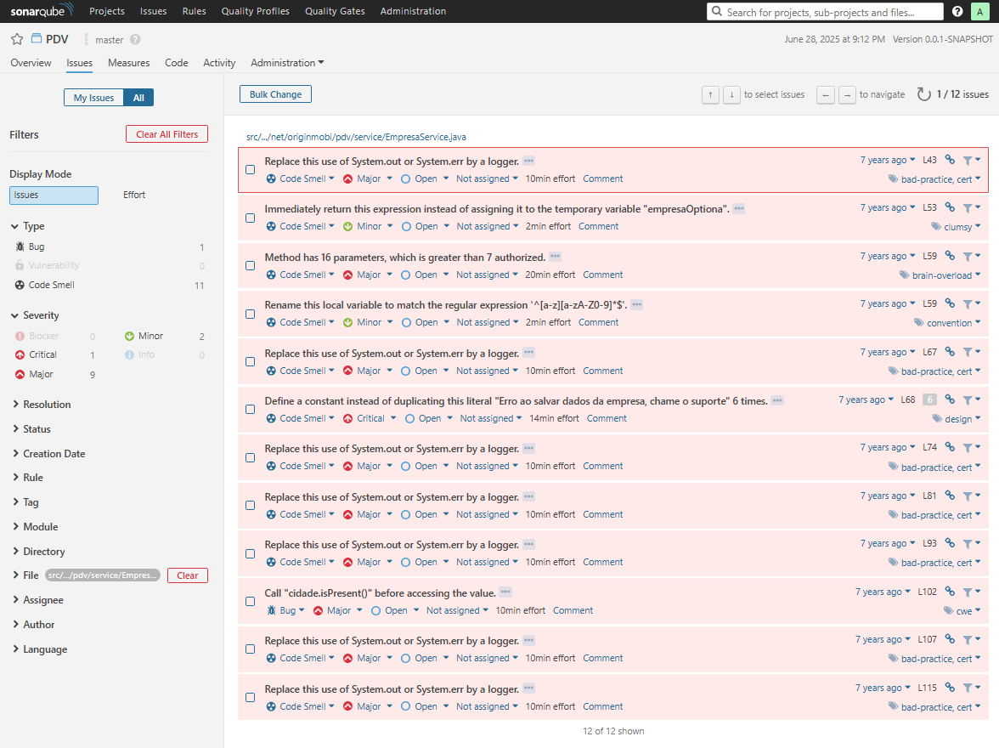
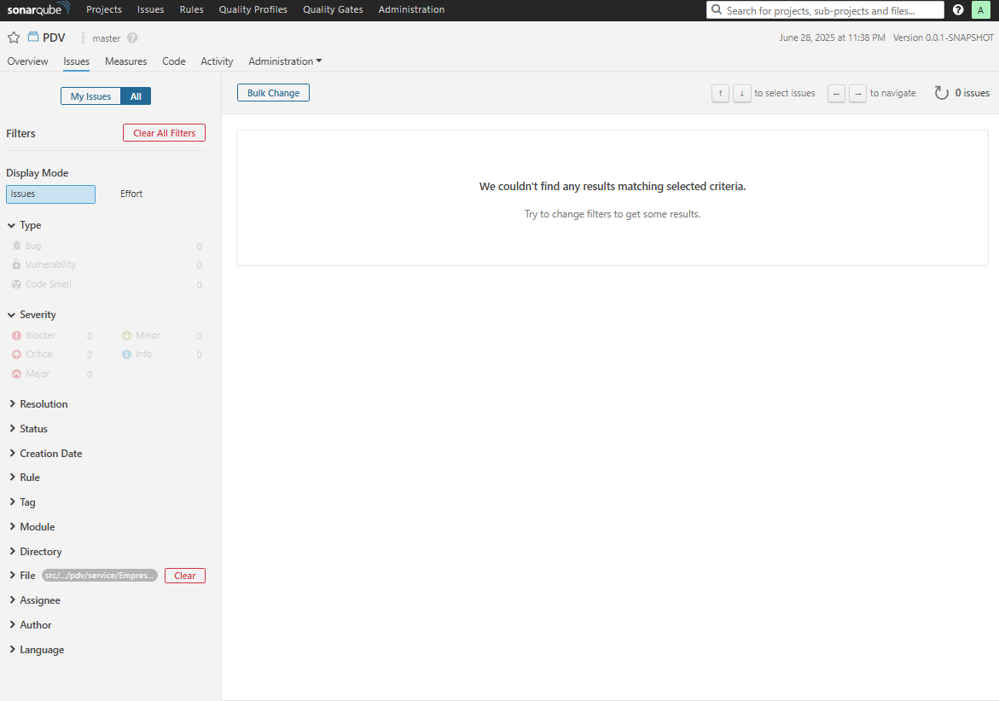
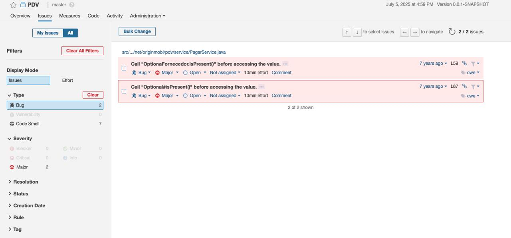
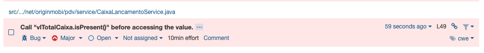
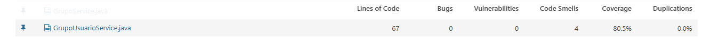
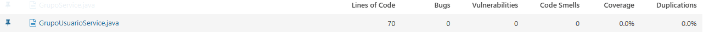
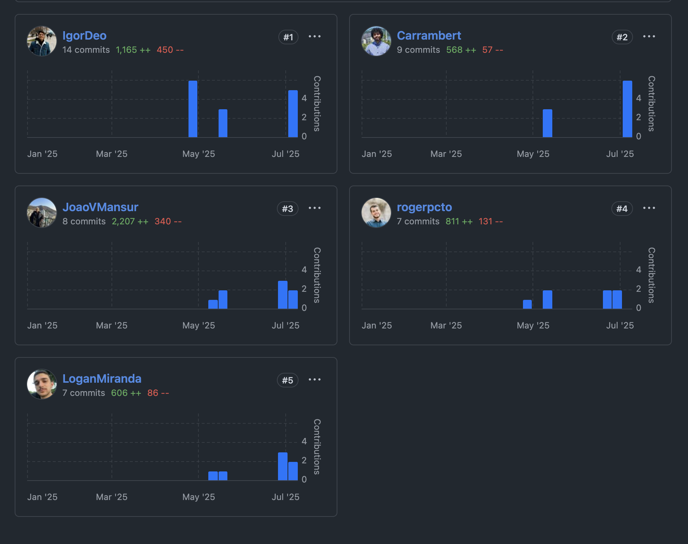

# pdv
Sistema de ERP web desenvolvido em Java com Spring Framework 

# Recursos
- Cadastro produtos/clientes/fornecedor
- Controle de estoque
- Gerenciar comandas
- Realizar venda
- Controle de fluxo de caixa
- Controle de pagar e receber
- Venda com cartões
- Gerenciar permissões de usuários por grupos
- Cadastrar novas formas de pagamentos
- Relatórios

# Instalação
Para instalar o sistema, você deve criar o banco de dado "pdv" no mysql e configurar o arquivo application.properties
com os dados do seu usuário root do mysql e rodar o projeto pelo Eclipse ou gerar o jar do mesmo e execultar.

# Logando no sistema
Para logar no sistema, use o usuário "gerente" e a senha "123".

# Tecnologias utilizadas
- Spring Framework 5
- Thymeleaf 3
- MySQL
- Hibernate
- FlyWay

# Sonar

1. Rode o comando `docker run -d --name sonarqube   -p 9000:9000   sonarqube:6.7` para subir o conteiner com o Sonar em [localhost:9000](http://localhost:9000/)

2. Siga o tutorial para gerar um token e rode o comando apresentado em tela. 
`mvn sonar:sonar   -Dsonar.host.url=http://localhost:9000   -Dsonar.login=<seu_token>`

# Contribuição dos participantes

## 👤 Roger Castellar:

1. Testes funcionais:
    - src/test/java/net/originmobi/pdv/service/EmpresaServiceTest.java

2. Testes de sistema(Selenium):
    - src/test/java/net/originmobi/pdv/selenium/PDVTest.java
    - src/test/java/net/originmobi/pdv/selenium/pageobjects/CaixaPage.java
    - src/test/java/net/originmobi/pdv/selenium/pageobjects/DespesasPage.java
    - src/test/java/net/originmobi/pdv/selenium/pageobjects/LoginPage.java
    
3. Testes de integração:

    

4. Correção dos bugs do sonar:

    Antes:
    

    Depois:
    

## 👤 JoaoVMansur:
1. Testes funcionais:
    - src/test/java/net/originmobi/pdv/service/PagarServiceTest.java

2. Testes de sistema(Selenium):
    - src/test/java/net/originmobi/pdv/selenium/python/GerenciarGrupoUsuarioTest.py
    
3. Testes de integração:

    

4. Correção dos bugs do sonar:

    Antes:
    

    Depois:
    

## 👤 Igor Deo Alves:
1. Testes funcionais:
    - src/test/java/net/originmobi/pdv/service/CaixaLancamentoServiceTest.java

2. Testes de sistema(Selenium):
    - src/test/java/net/originmobi/pdv/selenium/python/GerenciarCaixaTest.py

3. Testes de integração:

    

4. Correção dos bugs do sonar:

    Antes:
    

    Depois:
    

## 👤 Logan Miranda:

1. Testes funcionais:
    - src/test/java/net/originmobi/pdv/service/GrupoUsuarioServiceTest.java

2. Testes de sistema(Selenium):
    - src/test/java/net/originmobi/pdv/selenium/python/TrasferirCaixaCofreTeste.py

3. Testes de integração:

    

  
  
4. Correção dos bugs do sonar:

    Antes:
    

    Depois:
    

## 👤 Carrambert Albuquerque:
1. Testes funcionais:
    - src/test/java/net/originmobi/pdv/service/TransferenciaServiceTest.java

2. Testes de sistema(Selenium):
    - src/test/java/net/originmobi/pdv/selenium/python/AdicionarFornecedorTest.py

3. Testes de integração:

4. Correção dos bugs do sonar:

    Antes:
    

    Depois:
    

### Participação no repositório

